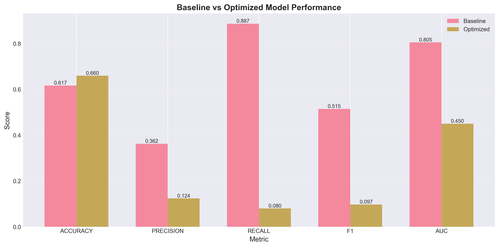
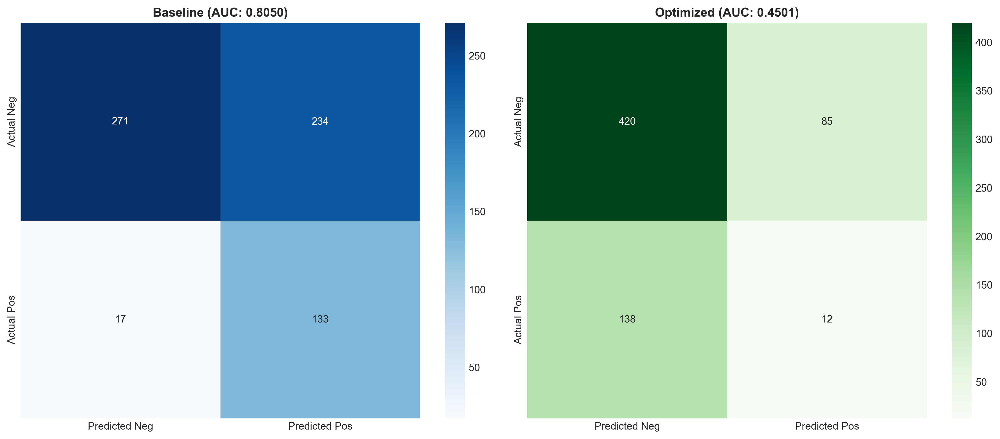
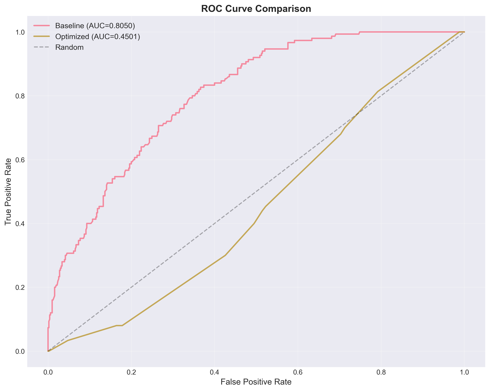

# Model Optimization Report

**Generated:** 2025-11-11 07:18:30

## Executive Summary

This report compares the baseline BiLSTM+Clustering model with the Optuna-optimized version.

### Key Improvements

| Metric | Baseline | Optimized | Improvement | Δ % |
|--------|----------|-----------|-------------|-----|
| ACCURACY | 0.6168 | 0.6595 | +0.0427 | +6.93% |
| PRECISION | 0.3624 | 0.1237 | -0.2387 | -65.86% |
| RECALL | 0.8867 | 0.0800 | -0.8067 | -90.98% |
| F1 | 0.5145 | 0.0972 | -0.4173 | -81.11% |
| AUC | 0.8050 | 0.4501 | -0.3549 | -44.08% |


### Highlights

- **AUC Improvement:** -44.08%
- **F1 Improvement:** -81.11%
- **Precision Improvement:** -65.86%

## Confusion Matrix Comparison

### Baseline
- True Positives: 133
- False Positives: 234
- True Negatives: 271
- False Negatives: 17

### Optimized
- True Positives: 12
- False Positives: 85
- True Negatives: 420
- False Negatives: 138

## Hyperparameter Changes

| Parameter | Baseline | Optimized | Changed |
|-----------|----------|-----------|---------|
| hidden_size | 256.0 | 256.0 |  |
| num_layers | 4.0 | 4.0 |  |
| dropout | 0.3107486457249 | 0.379597545259111 | ✓ |
| lr | 0.00022460107744912597 | 2.0513382630874486e-05 | ✓ |
| batch_size | 128.0 | 128.0 |  |
| n_clusters | 5.0 | 10.0 | ✓ |


## Model Architecture

### Baseline
- Parameters: 5,434,785
- Hidden Size: 256
- Layers: 4
- Dropout: 0.3107486457249

### Optimized
- Parameters: 5,434,945
- Hidden Size: 256
- Layers: 4
- Dropout: 0.379597545259111

## Visualizations







## Recommendations

⚠️ **Limited improvement.** Consider exploring additional architectural changes or data augmentation.


### Next Steps
1. **Test on real planet data** (Planet_LightCurve_Data) to validate generalization
2. **Compare with validation set** performance from training
3. **Consider ensemble methods** combining multiple optimized models
4. **Investigate attention mechanisms** for improved interpretability

## Dataset Information

- **Total Windows:** 655
- **Positive Samples:** 150 (22.9%)
- **Training Strategy:** Stratified split with class weighting

## Reproducibility

### Baseline Configuration
```json
{
  "windows_dir": "C:\\CS_4280_Project\\Code\\data\\windows_train",
  "val_split": 0.15,
  "n_clusters": 5,
  "cluster_embed_dim": 32,
  "hidden": 256,
  "layers": 4,
  "dropout": 0.3107486457249,
  "epochs": 80,
  "batch_size": 128,
  "lr": 0.00022460107744912597,
  "weight_decay": 7.558618306725896e-06,
  "pos_weight": 3.367,
  "gradient_clip": 1.0,
  "num_workers": 0,
  "amp_dtype": "fp16",
  "seed": 42,
  "save_dir": "C:\\CS_4280_Project\\Code\\runs\\bilstm_cluster_optimized",
  "cluster_info": {
    "n_clusters": 5,
    "feature_cols": [
      "period",
      "duration",
      "depth",
      "bls_power"
    ]
  }
}
```

### Optimized Configuration
```json
{
  "windows_dir": "C:/CS_4280_Project/Code/data/windows_train_400",
  "val_split": 0.15,
  "n_clusters": 10,
  "cluster_embed_dim": 32,
  "hidden": 256,
  "layers": 4,
  "dropout": 0.379597545259111,
  "epochs": 80,
  "batch_size": 128,
  "lr": 2.0513382630874486e-05,
  "weight_decay": 1e-05,
  "pos_weight": 2.302,
  "gradient_clip": 1.0,
  "num_workers": 0,
  "amp_dtype": "fp16",
  "seed": 42,
  "save_dir": "C:/CS_4280_Project/Code/runs/bilstm_cluster_balanced_final",
  "cluster_info": {
    "n_clusters": 10,
    "feature_cols": [
      "period",
      "duration",
      "depth",
      "bls_power"
    ]
  }
}
```

---

*Report generated by Claude Code for CS4280 Exoplanet Detection Project*
